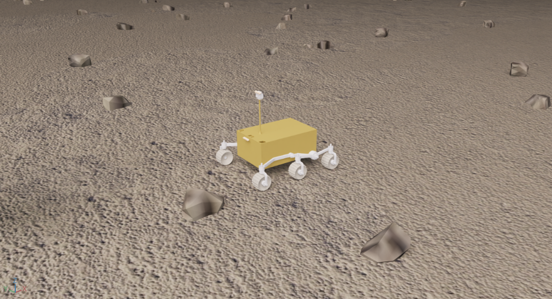

# PhysPlanet

A physics-aware simulation and learning platform for planetary rovers, built on Isaac Lab.
Terrain elevation, rock occupancy, semantics and soil physical properties are represented as
**spatially aligned fields**; the same fields drive rendering, collision, the vectorized
semi-empirical wheel–terrain model, simulator ground truth and policy observations. The
platform supports height-scan navigation for the Hunter SE off-road rover and the Zhurong
Mars rover, and ships a geometry / +semantic / +physics observation-ablation baseline.

> This project is under active development; interfaces and features may change.



## Requirements

- Ubuntu 22.04
- NVIDIA RTX GPU (32 GB VRAM recommended for large batch sizes)
- Isaac Sim 5.0
- Isaac Lab 2.2 (the `isaaclab` Python package)
- conda environment `env_isaaclab` (Isaac Sim, Isaac Lab and PyTorch)
- Optional: ROS 2 Humble (online elevation/friction mapping in `ros2_ws/`)

## Installation

Install Isaac Lab following the official guide:
[isaac-sim.github.io/IsaacLab/v2.2.1](https://isaac-sim.github.io/IsaacLab/v2.2.1/source/setup/installation/binaries_installation.html)

```bash
pip install -e source/physplanet_assets
pip install -e source/physplanet_tasks
pip install -e source/physplanet_rl
```

## Navigation baseline (observation ablation)

`source/physplanet_tasks` registers three observation conditions (Zhurong rover,
soft-soil terrain):

| Task ID                            | Observation                                                                             |
| ---------------------------------- | --------------------------------------------------------------------------------------- |
| `Isaac-ZhurongNavHeightscan-v10` | **Baseline**: height scan + dimension-matched zero-filled semantic/physics fields |
| `Isaac-ZhurongNavHeightscan-v11` | **+Semantic**: aligned one-hot semantic field                                     |
| `Isaac-ZhurongNavHeightscan-v12` | **+Physics**: semantic + aligned physical field (n0, φ)                          |
| `Isaac-HunterNavHeightscan-v0`   | Hunter SE chassis baseline                                                              |

Train and play:

```bash
python source/physplanet_rl/physplanet_rl/train.py --task Isaac-ZhurongNavHeightscan-v10 --num_envs 512
python source/physplanet_rl/physplanet_rl/play.py  --task Isaac-ZhurongNavHeightscan-v10
```

The terrain scene is selected through the `ROVER_TERRAIN` environment variable
(default `rl_demo/heightscan/01_easy`).

## Terrain generation

DEM/HiRISE or procedural elevation sources, Perlin terrain layers, rock-occupancy fields
and per-region soil physical profiles are all written as aligned fields on a common grid.
Generation inputs (textures and heightmaps) ship with the repository under
`source/physplanet_assets/terrain_generation/models/{textures,heightmaps}`. Large generated
outputs and the rock USD library are not distributed — see
[source/physplanet_assets/terrain_generation/README.md](source/physplanet_assets/terrain_generation/README.md).
Helper scripts: `source/physplanet_tasks/scripts/generate_heightscan_{easy,medium,hard}.sh`.

## Repository structure

```text
source/physplanet_assets/
  physplanet_assets/        # Zhurong / Hunter assets (URDF + USD), wheel configurations
  terrain_generation/       # aligned terrain-field generator (scripts + WebUI + configs)
  test/                     # asset and terramechanics sanity tests
  utils/                    # Hunter / Zhurong control and sensors
source/physplanet_tasks/    # task registration (observation-ablation baseline) + terrain launchers
source/physplanet_rl/       # skrl training / playback entry points
ros2_ws/                    # optional ROS 2 online-mapping stack
```

## License

Released under the [MIT License](LICENSE). Portions adapted from
[RLRoverLab](https://github.com/abmoRobotics/RLRoverLab), WheeledLab and Isaac Lab retain
their original license headers — see [THIRD_PARTY.md](THIRD_PARTY.md) and `LICENSES/`.

## Citation

The paper describing PhysPlanet is under review; citation information will be added upon
publication.
